<!-- markdownlint-disable -->
<h1 align="center">
    best-of-streamlit
    <br>
</h1>

<p align="center">
    <strong>🏆&nbsp; A ranked gallery of awesome streamlit apps built by the community.</strong>
</p>

<p align="center">
    <a href="https://best-of.org" title="Best-of Badge"></a>
    <a href="#-general-machine-learning" title="Project Count"></a>
    <a href="#Contributing" title="Contributing"></a>
    <a href="https://github.com/jrieke/best-of-streamlit/releases" title="Updates"></a>
</p>

This curated list contains 100 [streamlit](https://www.streamlit.io/) apps from 9 categories, ranked by Github stars (in total, the projects have 17K stars!). To add or update a project, please read the instructions [at the end of this file](#Contributing). You can also browse other [🏆 best-of lists](https://best-of.org) or create [your own](https://github.com/best-of-lists/best-of/blob/main/create-best-of-list.md).

<br>

---

<h3 align="center"><a href="https://github.com/jrieke/best-of-streamlit">View desktop-optimized version</a></h3>

---

<br>

[🤖 General Machine Learning](#-general-machine-learning) | [📚 Natural Language Processing](#-natural-language-processing) | [👁️ Computer Vision](#-computer-vision) | [🎵 Audio](#-audio) | [🔬 Science & Technology](#-science--technology) | [💰 Business & Economy](#-business--economy) | [🚀 Non-ML Apps](#-non-ml-apps) | [🧰 Extensions & Components](#-extensions--components) | [🎈 Official Demos](#-official-demos)

<br>

## 🤖 General Machine Learning

<a href="#"></a>

<table width="100%"><tr align="center"><td valign="top" width="33.3%"><br><a href="https://traingenerator.jrieke.com/"></a><br><h3><a href="https://traingenerator.jrieke.com/">Traingenerator</a></h3><p>⭐ 990 · <a href="https://github.com/jrieke/traingenerator">:octocat: Code</a></p><p>A web app to generate template code for machine learning</p><p><sup>by <a href="https://github.com/jrieke">@jrieke</a></sup></p></td></tr><tr align="center"><td valign="top" width="33.3%"><br><a href="https://github.com/davidefiocco/streamlit-fastapi-model-serving"></a><br><h3><a href="https://github.com/davidefiocco/streamlit-fastapi-model-serving">FastAPI Model Serving</a></h3><p>⭐ 110 · <a href="https://github.com/davidefiocco/streamlit-fastapi-model-serving">:octocat: Code</a></p><p>Simple web app example using streamlit and FastAPI to serve a PyTorch model</p><p><sup>by <a href="https://github.com/davidefiocco">@davidefiocco</a></sup></p></td></tr><tr align="center"><td valign="top" width="33.3%"><br><a href="https://github.com/madewithml/e2e-ml-app-pytorch"></a><br><h3><a href="https://github.com/madewithml/e2e-ml-app-pytorch">E2E ML App w/ PyTorch</a></h3><p>⭐ 69 · <a href="https://github.com/madewithml/e2e-ml-app-pytorch">:octocat: Code</a></p><p>An end-to-end ML applications using PyTorch, W&B, FastAPI, Docker, Streamlit and Heroku...</p><p><sup>by <a href="https://github.com/madewithml">@madewithml</a></sup></p></td></tr><tr align="center"><td valign="top" width="33.3%"><br><a href="https://github.com/cceyda/torchserve-dashboard"></a><br><h3><a href="https://github.com/cceyda/torchserve-dashboard">Torchserve Dashboard</a></h3><p>⭐ 35 · <a href="https://github.com/cceyda/torchserve-dashboard">:octocat: Code</a></p><p>Management Dashboard for Torchserve</p><p><sup>by <a href="https://github.com/cceyda">@cceyda</a></sup></p></td></tr><tr align="center"><td valign="top" width="33.3%"><br><a href="https://github.com/graphistry/graph-app-kit"></a><br><h3><a href="https://github.com/graphistry/graph-app-kit">Graph App Kit</a></h3><p>⭐ 33 · <a href="https://github.com/graphistry/graph-app-kit">:octocat: Code</a></p><p>Go from graph data to a secure and interactive visual graph app in 15 minutes</p><p><sup>by <a href="https://github.com/graphistry">@graphistry</a></sup></p></td></tr><tr align="center"><td valign="top" width="33.3%"><br><a href="https://github.com/angelolovatto/raylab"></a><br><h3><a href="https://github.com/angelolovatto/raylab">Raylab</a></h3><p>⭐ 26 · <a href="https://github.com/angelolovatto/raylab">:octocat: Code</a></p><p>Reinforcement learning algorithms in RLlib</p><p><sup>by <a href="https://github.com/angelolovatto">@angelolovatto</a></sup></p></td></tr><tr align="center"><td valign="top" width="33.3%"><br><a href="https://github.com/alvarobartt/tensorflow-serving-streamlit"></a><br><h3><a href="https://github.com/alvarobartt/tensorflow-serving-streamlit">TensorFlow Serving + Streamlit</a></h3><p>🐣 New · ⭐ 5 · <a href="https://github.com/alvarobartt/tensorflow-serving-streamlit">:octocat: Code</a></p><p>TensorFlow Serving + Streamlit!</p><p><sup>by <a href="https://github.com/alvarobartt">@alvarobartt</a></sup></p></td></tr></table>

<br>

## 📚 Natural Language Processing

<a href="#"></a>

<table width="100%"><tr align="center"><td valign="top" width="33.3%"><br><a href="https://huggingface.co/datasets/viewer/">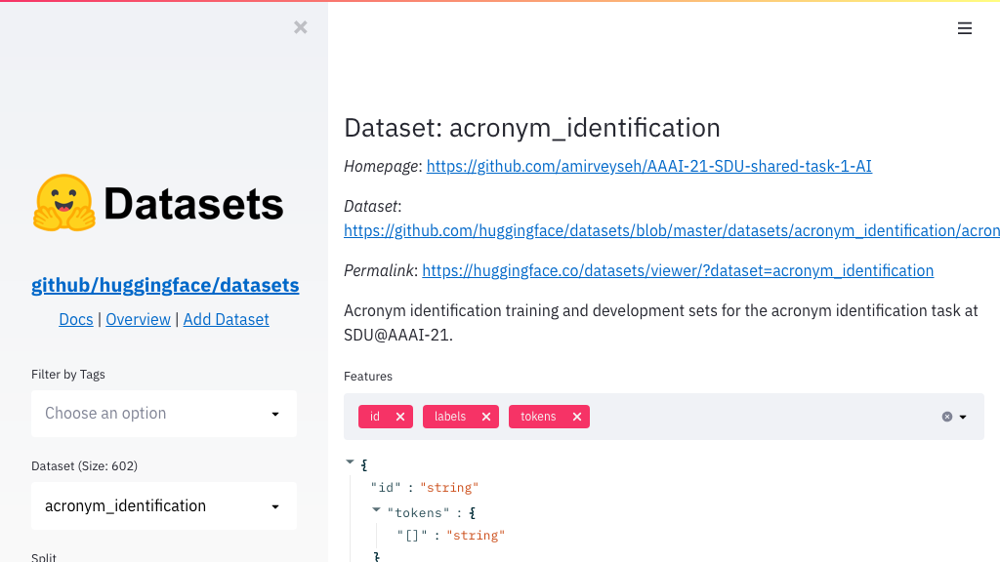</a><br><h3><a href="https://huggingface.co/datasets/viewer/">🤗 Datasets Viewer</a></h3><p>⭐ 8.1K · <a href="https://github.com/huggingface/datasets">:octocat: Code</a></p><p>The largest hub of ready-to-use NLP datasets for ML models with fast, easy-to-use and e...</p><p><sup>by <a href="https://github.com/huggingface">@huggingface</a></sup></p></td></tr><tr align="center"><td valign="top" width="33.3%"><br><a href="https://github.com/abhimishra91/insight"></a><br><h3><a href="https://github.com/abhimishra91/insight">Insight</a></h3><p>⭐ 250 · <a href="https://github.com/abhimishra91/insight">:octocat: Code</a></p><p>Repository for Project Insight: NLP as a Service</p><p><sup>by <a href="https://github.com/abhimishra91">@abhimishra91</a></sup></p></td></tr><tr align="center"><td valign="top" width="33.3%"><br><a href="https://share.streamlit.io/rasahq/nlu-training-data/main"></a><br><h3><a href="https://share.streamlit.io/rasahq/nlu-training-data/main">Intent Example Finder</a></h3><p>⭐ 120 · <a href="https://github.com/RasaHQ/NLU-training-data">:octocat: Code</a></p><p>Crowd sourced training data for Rasa NLU models</p><p><sup>by <a href="https://github.com/RasaHQ">@RasaHQ</a></sup></p></td></tr><tr align="center"><td valign="top" width="33.3%"><br><a href="https://share.streamlit.io/e-tony/story_generator/main/app.py"></a><br><h3><a href="https://share.streamlit.io/e-tony/story_generator/main/app.py">Rick & Morty Generator</a></h3><p>⭐ 19 · <a href="https://github.com/e-tony/Story_Generator">:octocat: Code</a></p><p>A Streamlit app that generates Rick and Morty stories using GPT2</p><p><sup>by <a href="https://github.com/e-tony">@e-tony</a></sup></p></td></tr><tr align="center"><td valign="top" width="33.3%"><br><a href="https://github.com/as-ideas/headliner-demo"></a><br><h3><a href="https://github.com/as-ideas/headliner-demo">Headliner Demo</a></h3><p>⭐ 17 · <a href="https://github.com/as-ideas/headliner-demo">:octocat: Code</a></p><p>Simple translation demo showcasing our headliner package</p><p><sup>by <a href="https://github.com/as-ideas">@as-ideas</a></sup></p></td></tr><tr align="center"><td valign="top" width="33.3%"><br><a href="https://github.com/godatadriven/rhyme-with-ai"></a><br><h3><a href="https://github.com/godatadriven/rhyme-with-ai">Rhyme with AI</a></h3><p>⭐ 16 · <a href="https://github.com/godatadriven/rhyme-with-ai">:octocat: Code</a></p><p>Rhyme with AI</p><p><sup>by <a href="https://github.com/godatadriven">@godatadriven</a></sup></p></td></tr><tr align="center"><td valign="top" width="33.3%"><br><a href="https://github.com/patidarparas13/Sentiment-Analyzer-Tool"></a><br><h3><a href="https://github.com/patidarparas13/Sentiment-Analyzer-Tool">Sentiment Analyzer</a></h3><p>⭐ 14 · <a href="https://github.com/patidarparas13/Sentiment-Analyzer-Tool">:octocat: Code</a></p><p>It analyze the sentiment of the user, whether it is postive or negative</p><p><sup>by <a href="https://github.com/patidarparas13">@patidarparas13</a></sup></p></td></tr><tr align="center"><td valign="top" width="33.3%"><br><a href="https://github.com/cjwallace/squote"></a><br><h3><a href="https://github.com/cjwallace/squote">Squote</a></h3><p>⭐ 9 · <a href="https://github.com/cjwallace/squote">:octocat: Code</a></p><p>Semantic search for quotes</p><p><sup>by <a href="https://github.com/cjwallace">@cjwallace</a></sup></p></td></tr><tr align="center"><td valign="top" width="33.3%"><br><a href="https://github.com/Anku5hk/Help-Me-Read/tree/master/Streamlit-Version"></a><br><h3><a href="https://github.com/Anku5hk/Help-Me-Read/tree/master/Streamlit-Version">Help Me Read</a></h3><p>⭐ 8 · <a href="https://github.com/Anku5hk/Help-Me-Read">:octocat: Code</a></p><p>Awesome app created with Streamlit + HuggingFace to get summary, question-answer, trans...</p><p><sup>by <a href="https://github.com/Anku5hk">@Anku5hk</a></sup></p></td></tr></table>

<br><details align="center"><summary><b>Show 2 more for "📚 Natural Language Processing"</b></summary><br><table width="100%"><tr align="center"><td valign="top" width="33.3%"><br><a href="https://github.com/dkajtoch/glove_streamlit"></a><br><h3><a href="https://github.com/dkajtoch/glove_streamlit">GloVe Explorer</a></h3><p>⭐ 2 · <a href="https://github.com/dkajtoch/glove_streamlit">:octocat: Code</a></p><p>Demonstration project of using Streamlit with word embeddings</p><p><sup>by <a href="https://github.com/dkajtoch">@dkajtoch</a></sup></p></td></tr><tr align="center"><td valign="top" width="33.3%"><br><a href="https://huggingface.co/zero-shot/">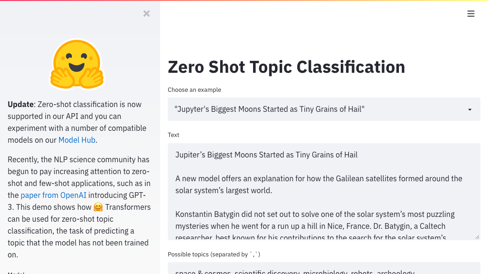</a><br><h3><a href="https://huggingface.co/zero-shot/">Zero Shot Topic Classification</a></h3><p>This demo shows how Transformers can be used for zero-shot topic classification, the ta...</p></td></tr></table></details>

<br>

## 👁️ Computer Vision

<a href="#"></a>

<table width="100%"><tr align="center"><td valign="top" width="33.3%"><br><a href="https://github.com/CompVis/taming-transformers"></a><br><h3><a href="https://github.com/CompVis/taming-transformers">Taming Transformers</a></h3><p>⭐ 1.3K · <a href="https://github.com/CompVis/taming-transformers">:octocat: Code</a></p><p>Taming Transformers for High-Resolution Image Synthesis, CVPR 2021 (Oral)</p><p><sup>by <a href="https://github.com/CompVis">@CompVis</a></sup></p></td></tr><tr align="center"><td valign="top" width="33.3%"><br><a href="https://github.com/CompVis/net2net"></a><br><h3><a href="https://github.com/CompVis/net2net">net2net</a></h3><p>⭐ 130 · <a href="https://github.com/CompVis/net2net">:octocat: Code</a></p><p>Network-to-Network Translation with Conditional Invertible Neural Networks</p><p><sup>by <a href="https://github.com/CompVis">@CompVis</a></sup></p></td></tr><tr align="center"><td valign="top" width="33.3%"><br><a href="https://github.com/robmarkcole/mqtt-camera-streamer"></a><br><h3><a href="https://github.com/robmarkcole/mqtt-camera-streamer">MQTT Camera Streamer</a></h3><p>⭐ 81 · <a href="https://github.com/robmarkcole/mqtt-camera-streamer">:octocat: Code</a></p><p>Stream images from a connected camera over MQTT, view using Streamlit, record to file a...</p><p><sup>by <a href="https://github.com/robmarkcole">@robmarkcole</a></sup></p></td></tr><tr align="center"><td valign="top" width="33.3%"><br><a href="https://github.com/i008/COCO-dataset-explorer"></a><br><h3><a href="https://github.com/i008/COCO-dataset-explorer">COCO Explorer</a></h3><p>⭐ 50 · <a href="https://github.com/i008/COCO-dataset-explorer">:octocat: Code</a></p><p>Streamlit tool to explore coco datasets</p><p><sup>by <a href="https://github.com/i008">@i008</a></sup></p></td></tr><tr align="center"><td valign="top" width="33.3%"><br><a href="https://github.com/amalshaji/style-transfer"></a><br><h3><a href="https://github.com/amalshaji/style-transfer">Style transfer web app</a></h3><p>⭐ 39 · <a href="https://github.com/amalshaji/style-transfer">:octocat: Code</a></p><p>style transfer web app [FastAPI + streamlit + Docker]</p><p><sup>by <a href="https://github.com/amalshaji">@amalshaji</a></sup></p></td></tr><tr align="center"><td valign="top" width="33.3%"><br><a href="https://github.com/robmarkcole/object-detection-app"></a><br><h3><a href="https://github.com/robmarkcole/object-detection-app">Object detection app</a></h3><p>⭐ 30 · <a href="https://github.com/robmarkcole/object-detection-app">:octocat: Code</a></p><p>Simple object detection app with streamlit</p><p><sup>by <a href="https://github.com/robmarkcole">@robmarkcole</a></sup></p></td></tr><tr align="center"><td valign="top" width="33.3%"><br><a href="https://share.streamlit.io/apugoneappu/ask_me_anything/main.py"></a><br><h3><a href="https://share.streamlit.io/apugoneappu/ask_me_anything/main.py">Ask Me Anything</a></h3><p>⭐ 29 · <a href="https://github.com/apugoneappu/ask_me_anything">:octocat: Code</a></p><p>An easy-to-use app to visualise attentions of various VQA models</p><p><sup>by <a href="https://github.com/apugoneappu">@apugoneappu</a></sup></p></td></tr><tr align="center"><td valign="top" width="33.3%"><br><a href="https://github.com/smaranjitghose/img_ai_app_boilerplate"></a><br><h3><a href="https://github.com/smaranjitghose/img_ai_app_boilerplate">Image Classification App</a></h3><p>⭐ 23 · <a href="https://github.com/smaranjitghose/img_ai_app_boilerplate">:octocat: Code</a></p><p>An image classification app boilerplate to serve your deep learning models asap!</p><p><sup>by <a href="https://github.com/smaranjitghose">@smaranjitghose</a></sup></p></td></tr><tr align="center"><td valign="top" width="33.3%"><br><a href="https://github.com/amineHY/WebApp-Computer-Vision-streamlit"></a><br><h3><a href="https://github.com/amineHY/WebApp-Computer-Vision-streamlit">Webapp Computer Vision</a></h3><p>⭐ 21 · <a href="https://github.com/amineHY/WebApp-Computer-Vision-streamlit">:octocat: Code</a></p><p>Computer Vision application in the web</p><p><sup>by <a href="https://github.com/amineHY">@amineHY</a></sup></p></td></tr></table>

<br><details align="center"><summary><b>Show 11 more for "👁️ Computer Vision"</b></summary><br><table width="100%"><tr align="center"><td valign="top" width="33.3%"><br><a href="https://share.streamlit.io/thoppe/alph-the-sacred-river/main"></a><br><h3><a href="https://share.streamlit.io/thoppe/alph-the-sacred-river/main">Alph, The Sacred River</a></h3><p>⭐ 21 · <a href="https://github.com/thoppe/alph-the-sacred-river">:octocat: Code</a></p><p>Combines poems and text using CLIP from OpenAI</p><p><sup>by <a href="https://github.com/thoppe">@thoppe</a></sup></p></td></tr><tr align="center"><td valign="top" width="33.3%"><br><a href="https://github.com/udaylunawat/Automatic-License-Plate-Recognition"></a><br><h3><a href="https://github.com/udaylunawat/Automatic-License-Plate-Recognition">Indian ALPR System</a></h3><p>⭐ 18 · <a href="https://github.com/udaylunawat/Automatic-License-Plate-Recognition">:octocat: Code</a></p><p>Source code of ALPR (Automatic License Plate Recognition System)</p><p><sup>by <a href="https://github.com/udaylunawat">@udaylunawat</a></sup></p></td></tr><tr align="center"><td valign="top" width="33.3%"><br><a href="https://github.com/yueureka/WildFireDetection"></a><br><h3><a href="https://github.com/yueureka/WildFireDetection">Wildfire Detection</a></h3><p>⭐ 18 · <a href="https://github.com/yueureka/WildFireDetection">:octocat: Code</a></p><p>Using U-Net Model to Detect Wildfire from Satellite Imagery</p><p><sup>by <a href="https://github.com/yueureka">@yueureka</a></sup></p></td></tr><tr align="center"><td valign="top" width="33.3%"><br><a href="https://ganpaint.io/miniclip/"></a><br><h3><a href="https://ganpaint.io/miniclip/">MiniClip</a></h3><p>🐣 New · ⭐ 10 · <a href="https://github.com/HendrikStrobelt/miniClip">:octocat: Code</a></p><p>A quick demo to explore text descriptions and saliency maps for Clip models</p><p><sup>by <a href="https://github.com/HendrikStrobelt">@HendrikStrobelt</a></sup></p></td></tr><tr align="center"><td valign="top" width="33.3%"><br><a href="https://github.com/virtualramblas/streamlit-face-mask-detector"></a><br><h3><a href="https://github.com/virtualramblas/streamlit-face-mask-detector">Face Mask Detector</a></h3><p>⭐ 9 · <a href="https://github.com/virtualramblas/streamlit-face-mask-detector">:octocat: Code</a></p><p>A simple Streamlit frontend for a pre-trained MobileNet CNN model + OpenCV for face mas...</p><p><sup>by <a href="https://github.com/virtualramblas">@virtualramblas</a></sup></p></td></tr><tr align="center"><td valign="top" width="33.3%"><br><a href="https://github.com/KimaruThagna/Picture-lytics"></a><br><h3><a href="https://github.com/KimaruThagna/Picture-lytics">Picture-lytics</a></h3><p>⭐ 8 · <a href="https://github.com/KimaruThagna/Picture-lytics">:octocat: Code</a></p><p>Using Google's teachable machine to generate an image classification model and serving ...</p><p><sup>by <a href="https://github.com/KimaruThagna">@KimaruThagna</a></sup></p></td></tr><tr align="center"><td valign="top" width="33.3%"><br><a href="https://github.com/robmarkcole/text-insights-app"></a><br><h3><a href="https://github.com/robmarkcole/text-insights-app">Text Insights</a></h3><p>⭐ 7 · <a href="https://github.com/robmarkcole/text-insights-app">:octocat: Code</a></p><p>Upload an image of a document and extract text, names, facts and figures</p><p><sup>by <a href="https://github.com/robmarkcole">@robmarkcole</a></sup></p></td></tr><tr align="center"><td valign="top" width="33.3%"><br><a href="https://bot-beats-ml-app.herokuapp.com/"></a><br><h3><a href="https://bot-beats-ml-app.herokuapp.com/">Plant Disease Detection</a></h3><p>⭐ 5 · <a href="https://github.com/AmeyaUpalanchi/streamlit-tensorflow-ml-app">:octocat: Code</a></p><p>Web App for Plant Disease Detection using Tensorflow and streamlit</p><p><sup>by <a href="https://github.com/AmeyaUpalanchi">@AmeyaUpalanchi</a></sup></p></td></tr><tr align="center"><td valign="top" width="33.3%"><br><a href="https://share.streamlit.io/jojo96/webvrcodegenerator/main/ar.py"></a><br><h3><a href="https://share.streamlit.io/jojo96/webvrcodegenerator/main/ar.py">Web VR Code Generator</a></h3><p>🐣 New · ⭐ 4 · <a href="https://github.com/jojo96/WebVRCodeGenerator">:octocat: Code</a></p><p>A simple app that generates WebVR code for scenes made using A-Frame primitives and dis...</p><p><sup>by <a href="https://github.com/jojo96">@jojo96</a></sup></p></td></tr><tr align="center"><td valign="top" width="33.3%"><br><a href="https://www.clipplayground.co/">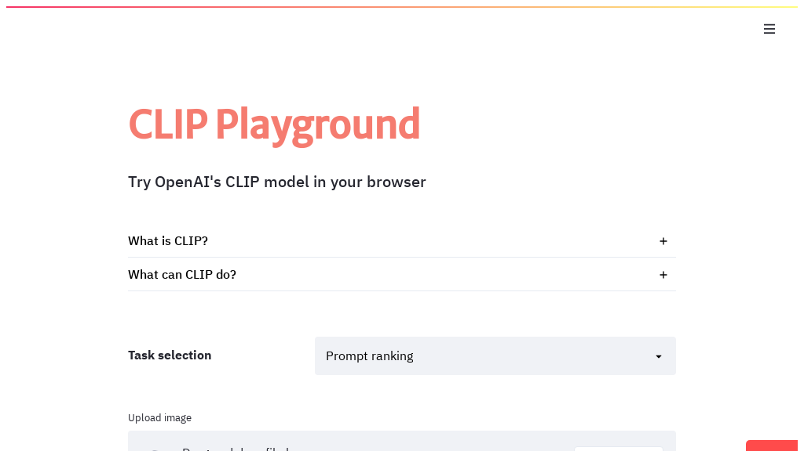</a><br><h3><a href="https://www.clipplayground.co/">CLIP Playground</a></h3><p>🐣 New · ⭐ 2 · <a href="https://github.com/JaviFuentes94/clip-playground">:octocat: Code</a></p><p>A playground to try out OpenAI's CLIP model</p><p><sup>by <a href="https://github.com/JaviFuentes94">@JaviFuentes94</a></sup></p></td></tr><tr align="center"><td valign="top" width="33.3%"><br><a href="https://github.com/virtualramblas/streamlit-materials-segmentation-in-vessels"></a><br><h3><a href="https://github.com/virtualramblas/streamlit-materials-segmentation-in-vessels">Material Segmentation</a></h3><p>🐣 New · <a href="https://github.com/virtualramblas/streamlit-materials-segmentation-in-vessels">:octocat: Code</a></p><p>Streamlit app for detecting, segmenting and classifying materials inside mostly transpa...</p><p><sup>by <a href="https://github.com/virtualramblas">@virtualramblas</a></sup></p></td></tr></table></details>

<br>

## 🎵 Audio

<a href="#"></a>

<table width="100%"><tr align="center"><td valign="top" width="33.3%"><br><a href="http://chime-soundboard.herokuapp.com/">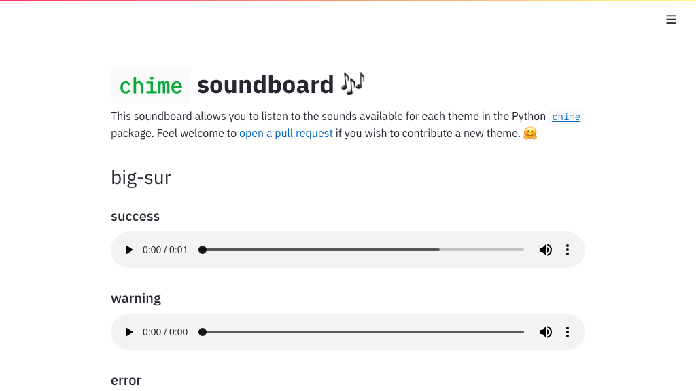</a><br><h3><a href="http://chime-soundboard.herokuapp.com/">chime soundboard</a></h3><p>⭐ 63 · <a href="https://github.com/MaxHalford/chime">:octocat: Code</a></p><p>Python sound notifications made easy</p><p><sup>by <a href="https://github.com/MaxHalford">@MaxHalford</a></sup></p></td></tr><tr align="center"><td valign="top" width="33.3%"><br><a href="https://neuralpiano.herokuapp.com/">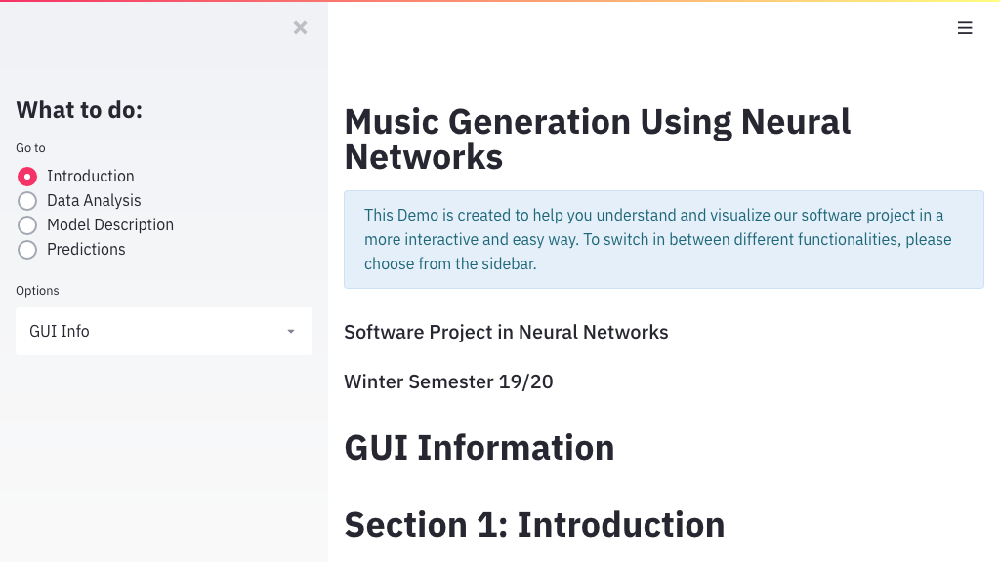</a><br><h3><a href="https://neuralpiano.herokuapp.com/">Music Generation</a></h3><p>⭐ 3 · <a href="https://github.com/Sohaib90/Music_Gen_Streamlit">:octocat: Code</a></p><p>Music Generation using Neural Networks Streamlit App</p><p><sup>by <a href="https://github.com/Sohaib90">@Sohaib90</a></sup></p></td></tr></table>

<br>

## 🔬 Science & Technology

<a href="#"></a>

<table width="100%"><tr align="center"><td valign="top" width="33.3%"><br><a href="https://farolcovid.coronacidades.org/">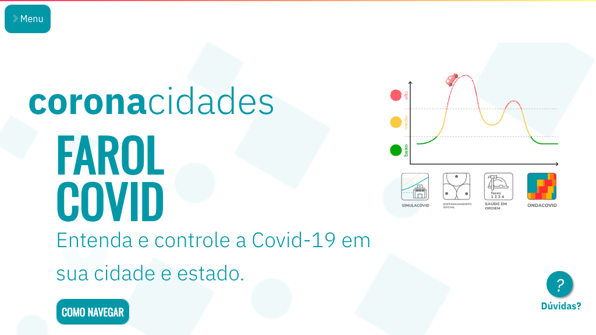</a><br><h3><a href="https://farolcovid.coronacidades.org/">FarolCovid</a></h3><p>⭐ 37 · <a href="https://github.com/ImpulsoGov/farolcovid">:octocat: Code</a></p><p>. Ferramenta de monitoramento do risco de colapso no sistema de sade em municpios brasi...</p><p><sup>by <a href="https://github.com/ImpulsoGov">@ImpulsoGov</a></sup></p></td></tr><tr align="center"><td valign="top" width="33.3%"><br><a href="https://covid19.cwerner.ai/"></a><br><h3><a href="https://covid19.cwerner.ai/">Covid-19 Data Explorer</a></h3><p>⭐ 19 · <a href="https://github.com/cwerner/covid19">:octocat: Code</a></p><p>Dashboard for the COVID19 spread</p><p><sup>by <a href="https://github.com/cwerner">@cwerner</a></sup></p></td></tr><tr align="center"><td valign="top" width="33.3%"><br><a href="http://ezancestry.herokuapp.com/"></a><br><h3><a href="http://ezancestry.herokuapp.com/">Genetic Ancestry</a></h3><p>⭐ 19 · <a href="https://github.com/arvkevi/ezancestry">:octocat: Code</a></p><p>Visualize your personal genetics data</p><p><sup>by <a href="https://github.com/arvkevi">@arvkevi</a></sup></p></td></tr><tr align="center"><td valign="top" width="33.3%"><br><a href="https://auto-vaidya.herokuapp.com/">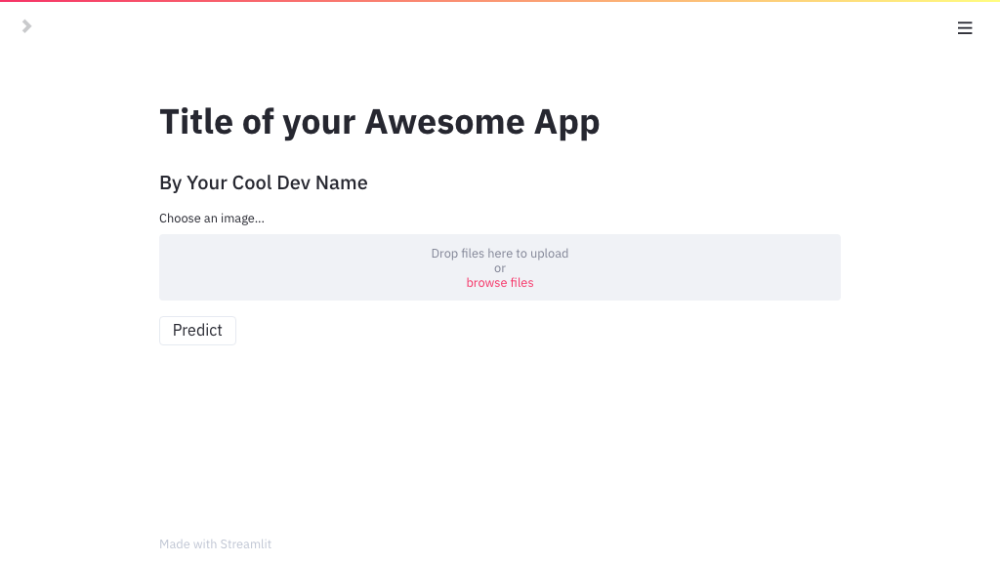</a><br><h3><a href="https://auto-vaidya.herokuapp.com/">Auto Vaidya</a></h3><p>⭐ 18 · <a href="https://github.com/smaranjitghose/auto_vaidya">:octocat: Code</a></p><p>An open-source project for applying deep learning to medical scenarios</p><p><sup>by <a href="https://github.com/Auto-Vaidya">@Auto-Vaidya</a></sup></p></td></tr><tr align="center"><td valign="top" width="33.3%"><br><a href="https://github.com/heyad/covid19"></a><br><h3><a href="https://github.com/heyad/covid19">Covid19-Scotland</a></h3><p>⭐ 12 · <a href="https://github.com/heyad/covid19">:octocat: Code</a></p><p>Load, explore and analyse data from Scotland and rest of the world related to Covid19</p><p><sup>by <a href="https://github.com/heyad">@heyad</a></sup></p></td></tr><tr align="center"><td valign="top" width="33.3%"><br><a href="https://share.streamlit.io/panditpranav/svm_covid_tracking/main/COVID_app.py"></a><br><h3><a href="https://share.streamlit.io/panditpranav/svm_covid_tracking/main/COVID_app.py">Covid Tracking</a></h3><p>⭐ 7 · <a href="https://github.com/PanditPranav/SVM_COVID_tracking">:octocat: Code</a></p><p>COVID Tracking app for data in Northern California</p><p><sup>by <a href="https://github.com/PanditPranav">@PanditPranav</a></sup></p></td></tr><tr align="center"><td valign="top" width="33.3%"><br><a href="https://share.streamlit.io/jkanner/streamlit-dataview/app.py"></a><br><h3><a href="https://share.streamlit.io/jkanner/streamlit-dataview/app.py">Gravitational Wave App</a></h3><p>⭐ 7 · <a href="https://github.com/jkanner/streamlit-dataview">:octocat: Code</a></p><p>Streamlit viewer for GW data</p><p><sup>by <a href="https://github.com/jkanner">@jkanner</a></sup></p></td></tr><tr align="center"><td valign="top" width="33.3%"><br><a href="https://covid19-dashboard-it.appspot.com/"></a><br><h3><a href="https://covid19-dashboard-it.appspot.com/">COVID-19 in Italy</a></h3><p>⭐ 4 · <a href="https://github.com/francesconazzaro/covid19-portal">:octocat: Code</a></p><p>Analyse data for COVID-19 vaccines administrations and COVID-19 infections in Italy</p><p><sup>by <a href="https://github.com/francesconazzaro">@francesconazzaro</a></sup></p></td></tr><tr align="center"><td valign="top" width="33.3%"><br><a href="https://share.streamlit.io/mwalmsley/galaxy-poster/gz_decals_mike_walmsley.py"></a><br><h3><a href="https://share.streamlit.io/mwalmsley/galaxy-poster/gz_decals_mike_walmsley.py">Galaxy Zoo</a></h3><p>⭐ 2 · <a href="https://github.com/mwalmsley/galaxy-poster">:octocat: Code</a></p><p>Search galaxies by morphology</p><p><sup>by <a href="https://github.com/mwalmsley">@mwalmsley</a></sup></p></td></tr></table>

<br><details align="center"><summary><b>Show 3 more for "🔬 Science & Technology"</b></summary><br><table width="100%"><tr align="center"><td valign="top" width="33.3%"><br><a href="https://share.streamlit.io/manik456/brain_tumor_classifier/main/new_brain.py"></a><br><h3><a href="https://share.streamlit.io/manik456/brain_tumor_classifier/main/new_brain.py">Brain Tumor Detector</a></h3><p>⭐ 1 · <a href="https://github.com/manik456/brain_tumor_classifier">:octocat: Code</a></p><p>Find out whether there is a tumor in the brain (or) not by uploading the MRI of it</p><p><sup>by <a href="https://github.com/manik456">@manik456</a></sup></p></td></tr><tr align="center"><td valign="top" width="33.3%"><br><a href="https://share.streamlit.io/mesmith027/streamlit_webapps/main/MC_pi/streamlit_app.py">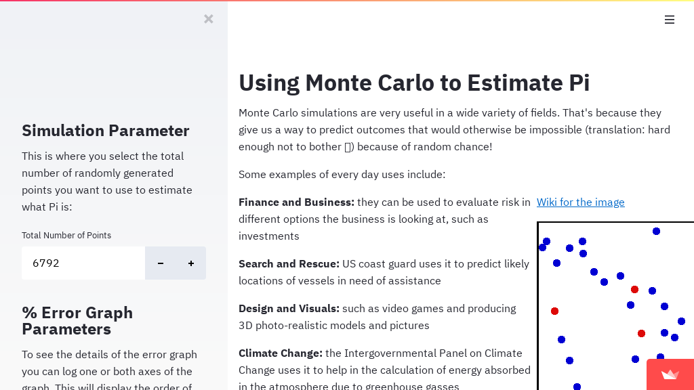</a><br><h3><a href="https://share.streamlit.io/mesmith027/streamlit_webapps/main/MC_pi/streamlit_app.py">Monte Carlo for Pi</a></h3><p><a href="https://github.com/mesmith027/streamlit_webapps">:octocat: Code</a></p><p>Using Monte Carlo to Estimate Pi</p><p><sup>by <a href="https://github.com/mesmith027">@mesmith027</a></sup></p></td></tr><tr align="center"><td valign="top" width="33.3%"><br><a href="https://covid19.multivacplatform.org/"></a><br><h3><a href="https://covid19.multivacplatform.org/">Interactive COVID-19</a></h3><p>Analyze the cumulative data of confirmed, deaths, and recovered cases over time</p></td></tr></table></details>

<br>

## 💰 Business & Economy

<a href="#"></a>

<table width="100%"><tr align="center"><td valign="top" width="33.3%"><br><a href="https://streamlit-finance-chart.herokuapp.com/"></a><br><h3><a href="https://streamlit-finance-chart.herokuapp.com/">Finance Chart</a></h3><p>⭐ 67 · <a href="https://github.com/paduel/streamlit_finance_chart">:octocat: Code</a></p><p>This app is a simple example of using Strealit to create a financial data web app</p><p><sup>by <a href="https://github.com/paduel">@paduel</a></sup></p></td></tr><tr align="center"><td valign="top" width="33.3%"><br><a href="https://essential-stock-analysis.herokuapp.com/"></a><br><h3><a href="https://essential-stock-analysis.herokuapp.com/">StockAnalysisApp</a></h3><p>⭐ 43 · <a href="https://github.com/antonio-catalano/StockAnalysisApp">:octocat: Code</a></p><p>A stock analysis app with streamlit</p><p><sup>by <a href="https://github.com/antonio-catalano">@antonio-catalano</a></sup></p></td></tr><tr align="center"><td valign="top" width="33.3%"><br><a href="https://github.com/jroakes/tech-seo-crawler"></a><br><h3><a href="https://github.com/jroakes/tech-seo-crawler">TechSEO Crawler</a></h3><p>⭐ 41 · <a href="https://github.com/jroakes/tech-seo-crawler">:octocat: Code</a></p><p>Build a small, 3 domain internet using Github pages and Wikipedia and construct a crawl...</p><p><sup>by <a href="https://github.com/jroakes">@jroakes</a></sup></p></td></tr><tr align="center"><td valign="top" width="33.3%"><br><a href="https://github.com/asehmi/Data-Science-Meetup-Oxford/tree/master/GlobalCities"></a><br><h3><a href="https://github.com/asehmi/Data-Science-Meetup-Oxford/tree/master/GlobalCities">Global cities explorer</a></h3><p>⭐ 28 · <a href="https://github.com/asehmi/Data-Science-Meetup-Oxford">:octocat: Code</a></p><p>Content shared at DS-OX Meetup</p><p><sup>by <a href="https://github.com/asehmi">@asehmi</a></sup></p></td></tr><tr align="center"><td valign="top" width="33.3%"><br><a href="https://autoforecast-prophet.herokuapp.com/"></a><br><h3><a href="https://autoforecast-prophet.herokuapp.com/">Time Series Forecasting</a></h3><p>⭐ 21 · <a href="https://github.com/zachrenwick/streamlit_forecasting_app">:octocat: Code</a></p><p>This MVP data web app uses the Streamlit framework and Facebook's Prophet forecasting p...</p><p><sup>by <a href="https://github.com/zachrenwick">@zachrenwick</a></sup></p></td></tr><tr align="center"><td valign="top" width="33.3%"><br><a href="https://github.com/bukosabino/streamlit-demo-financial-eda"></a><br><h3><a href="https://github.com/bukosabino/streamlit-demo-financial-eda">EDA on Financial Dataset</a></h3><p>⭐ 19 · <a href="https://github.com/bukosabino/streamlit-demo-financial-eda">:octocat: Code</a></p><p>Automated Exploration Data Analysis on a financial dataset</p><p><sup>by <a href="https://github.com/bukosabino">@bukosabino</a></sup></p></td></tr><tr align="center"><td valign="top" width="33.3%"><br><a href="https://github.com/Ivyw1219/Marketing_Campaign_APP"></a><br><h3><a href="https://github.com/Ivyw1219/Marketing_Campaign_APP">Marketing Campaign App</a></h3><p>⭐ 12 · <a href="https://github.com/Ivyw1219/Marketing_Campaign_APP">:octocat: Code</a></p><p>A streamlit APP DEMO (python, plotly)</p><p><sup>by <a href="https://github.com/Ivyw1219">@Ivyw1219</a></sup></p></td></tr><tr align="center"><td valign="top" width="33.3%"><br><a href="https://github.com/miclindahl/tsp-streamlit/"></a><br><h3><a href="https://github.com/miclindahl/tsp-streamlit/">Travelling Salesman</a></h3><p>⭐ 3 · <a href="https://github.com/miclindahl/tsp-streamlit">:octocat: Code</a></p><p>Animation of solving the traveling salesman problem to optimality using mixed-integer p...</p><p><sup>by <a href="https://github.com/miclindahl">@miclindahl</a></sup></p></td></tr></table>

<br>

## 🚀 Non-ML Apps

<a href="#"></a>

<table width="100%"><tr align="center"><td valign="top" width="33.3%"><br><a href="http://gh2020.jrieke.com/"></a><br><h3><a href="http://gh2020.jrieke.com/">Year on Github</a></h3><p>⭐ 110 · <a href="https://github.com/jrieke/year-on-github">:octocat: Code</a></p><p>Share your Github stats for 2020 on Twitter</p><p><sup>by <a href="https://github.com/jrieke">@jrieke</a></sup></p></td></tr><tr align="center"><td valign="top" width="33.3%"><br><a href="https://share.streamlit.io/daniellewisdl/streamlit-cheat-sheet/master/app.py"></a><br><h3><a href="https://share.streamlit.io/daniellewisdl/streamlit-cheat-sheet/master/app.py">Cheat Sheet</a></h3><p>⭐ 100 · <a href="https://github.com/daniellewisDL/streamlit-cheat-sheet">:octocat: Code</a></p><p>A cheat sheet for streamlit</p><p><sup>by <a href="https://github.com/daniellewisDL">@daniellewisDL</a></sup></p></td></tr><tr align="center"><td valign="top" width="33.3%"><br><a href="https://share.streamlit.io/gagan3012/project-code-py/app.py"></a><br><h3><a href="https://share.streamlit.io/gagan3012/project-code-py/app.py">Project Code</a></h3><p>🐣 New · ⭐ 33 · <a href="https://github.com/gagan3012/project-code-py">:octocat: Code</a></p><p>Leetcode using AI</p><p><sup>by <a href="https://github.com/gagan3012">@gagan3012</a></sup></p></td></tr><tr align="center"><td valign="top" width="33.3%"><br><a href="https://github.com/collinprather/streamlit-docker"></a><br><h3><a href="https://github.com/collinprather/streamlit-docker">Containerized App</a></h3><p>⭐ 28 · <a href="https://github.com/collinprather/streamlit-docker">:octocat: Code</a></p><p>Bare bones use-case for deploying a containerized web app (built in streamlit) on AWS</p><p><sup>by <a href="https://github.com/collinprather">@collinprather</a></sup></p></td></tr><tr align="center"><td valign="top" width="33.3%"><br><a href="https://github.com/dhaitz/matplotlib-style-configurator"></a><br><h3><a href="https://github.com/dhaitz/matplotlib-style-configurator">Matplotlib Configurator</a></h3><p>⭐ 19 · <a href="https://github.com/dhaitz/matplotlib-style-configurator">:octocat: Code</a></p><p>Matplotlib style configurator, built with Streamlit</p><p><sup>by <a href="https://github.com/dhaitz">@dhaitz</a></sup></p></td></tr><tr align="center"><td valign="top" width="33.3%"><br><a href="https://whatsapp-chat-analyzer.herokuapp.com/"></a><br><h3><a href="https://whatsapp-chat-analyzer.herokuapp.com/">Whatsapp Chat Analyzer</a></h3><p>⭐ 18 · <a href="https://github.com/pcsingh/WhatsApp-Chat-Analyzer">:octocat: Code</a></p><p>WhatsApp Chat Analyzer is a WebApp and it can be used by anyone to analyze their chat</p><p><sup>by <a href="https://github.com/pcsingh">@pcsingh</a></sup></p></td></tr><tr align="center"><td valign="top" width="33.3%"><br><a href="https://share.streamlit.io/tylerjrichards/streamlit_goodreads_app/books.py">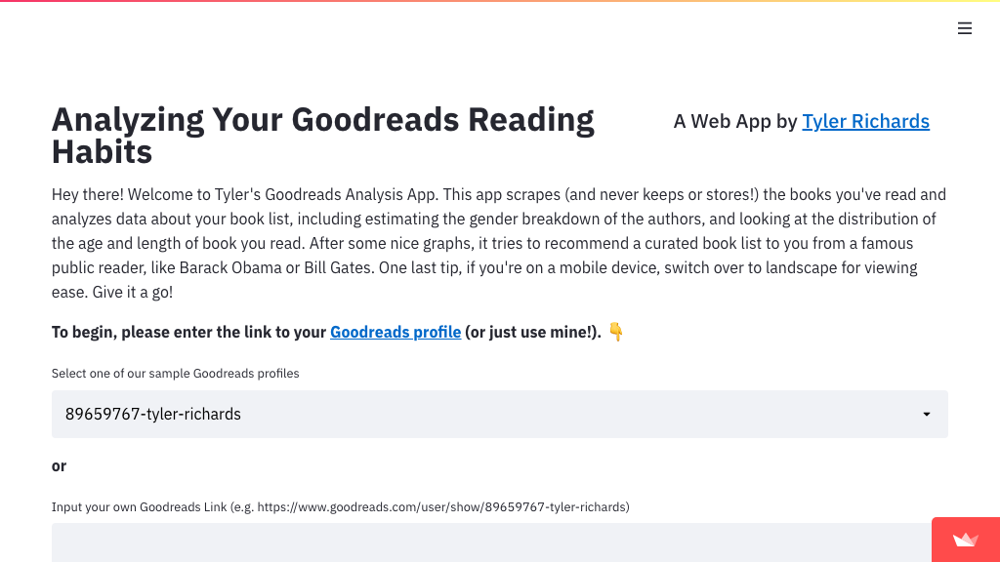</a><br><h3><a href="https://share.streamlit.io/tylerjrichards/streamlit_goodreads_app/books.py">Goodreads App</a></h3><p>⭐ 17 · <a href="https://github.com/tylerjrichards/streamlit_goodreads_app">:octocat: Code</a></p><p>Analyzing Your Goodreads Reading Habits</p><p><sup>by <a href="https://github.com/tylerjrichards">@tylerjrichards</a></sup></p></td></tr><tr align="center"><td valign="top" width="33.3%"><br><a href="https://bgexploration.herokuapp.com/"></a><br><h3><a href="https://bgexploration.herokuapp.com/">Board Game Exploration</a></h3><p>⭐ 13 · <a href="https://github.com/MaartenGr/boardgame">:octocat: Code</a></p><p>Heroku app to explore boardgame data</p><p><sup>by <a href="https://github.com/MaartenGr">@MaartenGr</a></sup></p></td></tr><tr align="center"><td valign="top" width="33.3%"><br><a href="https://github.com/QAInsights/Streamlit-JMeter"></a><br><h3><a href="https://github.com/QAInsights/Streamlit-JMeter">Apache JMeter</a></h3><p>⭐ 10 · <a href="https://github.com/QAInsights/Streamlit-JMeter">:octocat: Code</a></p><p>Powering up Apache JMeter with Streamlit and opening the door for machine learning</p><p><sup>by <a href="https://github.com/QAInsights">@QAInsights</a></sup></p></td></tr></table>

<br><details align="center"><summary><b>Show 4 more for "🚀 Non-ML Apps"</b></summary><br><table width="100%"><tr align="center"><td valign="top" width="33.3%"><br><a href="http://54.147.143.114:8501/">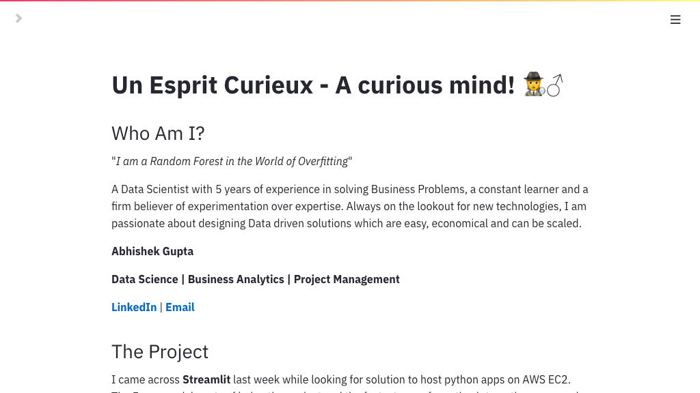</a><br><h3><a href="http://54.147.143.114:8501/">Resume App</a></h3><p>⭐ 10 · <a href="https://github.com/alphadatagamma/Streamlit-Resume-App">:octocat: Code</a></p><p>Interactive resume created on Streamlit and hosted on AWS EC2</p><p><sup>by <a href="https://github.com/alphadatagamma">@alphadatagamma</a></sup></p></td></tr><tr align="center"><td valign="top" width="33.3%"><br><a href="https://share.streamlit.io/arup-group/eviction-data/run.py">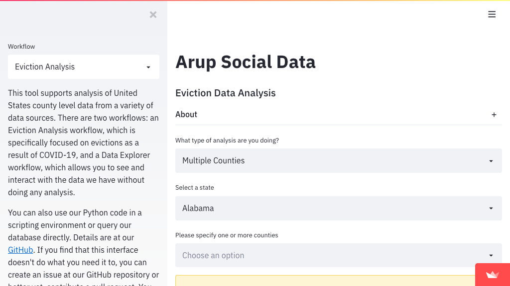</a><br><h3><a href="https://share.streamlit.io/arup-group/eviction-data/run.py">Arup Social Data</a></h3><p>⭐ 9 · <a href="https://github.com/arup-group/social-data">:octocat: Code</a></p><p>Code and data for eviction and housing analysis in the US</p><p><sup>by <a href="https://github.com/arup-group">@arup-group</a></sup></p></td></tr><tr align="center"><td valign="top" width="33.3%"><br><a href="https://github.com/CharlyWargnier/python-html-table-scraper"></a><br><h3><a href="https://github.com/CharlyWargnier/python-html-table-scraper">HTML Table Scraper</a></h3><p>⭐ 7 · <a href="https://github.com/CharlyWargnier/python-html-table-scraper">:octocat: Code</a></p><p>A simple HTML table scraper made with Python and the amazing Streamlit!</p><p><sup>by <a href="https://github.com/CharlyWargnier">@CharlyWargnier</a></sup></p></td></tr><tr align="center"><td valign="top" width="33.3%"><br><a href="https://liverpoolanalyzer.herokuapp.com/">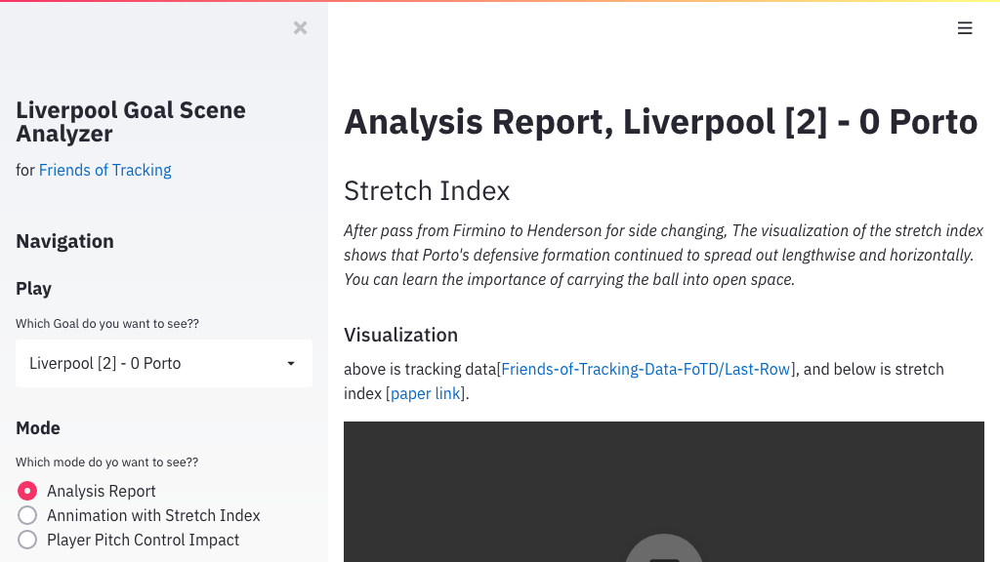</a><br><h3><a href="https://liverpoolanalyzer.herokuapp.com/">Liverpool Analyzer</a></h3><p>⭐ 3 · <a href="https://github.com/saeeeeru/Last-Row">:octocat: Code</a></p><p>Last row tracking data and code</p><p><sup>by <a href="https://github.com/saeeeeru">@saeeeeru</a></sup></p></td></tr></table></details>

<br>

## 🧰 Extensions & Components

<a href="#"></a>

<table width="100%"><tr align="center"><td valign="top" width="33.3%"><br><a href="https://facebookresearch.github.io/hiplot/tuto_streamlit.html"></a><br><h3><a href="https://facebookresearch.github.io/hiplot/tuto_streamlit.html">HiPlot</a></h3><p>⭐ 2.1K · <a href="https://github.com/facebookresearch/hiplot">:octocat: Code</a></p><p>HiPlot makes understanding high dimensional data easy</p><p><sup>by <a href="https://github.com/facebookresearch">@facebookresearch</a></sup></p></td></tr><tr align="center"><td valign="top" width="33.3%"><br><a href="https://share.streamlit.io/ines/spacy-streamlit-demo/master/app.py"></a><br><h3><a href="https://share.streamlit.io/ines/spacy-streamlit-demo/master/app.py">spaCy</a></h3><p>⭐ 380 · <a href="https://github.com/explosion/spacy-streamlit">:octocat: Code</a></p><p>spaCy building blocks and visualizers for Streamlit apps</p><p><sup>by <a href="https://github.com/explosion">@explosion</a></sup></p></td></tr><tr align="center"><td valign="top" width="33.3%"><br><a href="https://github.com/ideonate/cdsdashboards"></a><br><h3><a href="https://github.com/ideonate/cdsdashboards">ContainDS Dashboards</a></h3><p>⭐ 100 · <a href="https://github.com/ideonate/cdsdashboards">:octocat: Code</a></p><p>JupyterHub extension for ContainDS Dashboards</p><p><sup>by <a href="https://github.com/ideonate">@ideonate</a></sup></p></td></tr><tr align="center"><td valign="top" width="33.3%"><br><a href="https://share.streamlit.io/andfanilo/streamlit-drawable-canvas-demo/master/app.py"></a><br><h3><a href="https://share.streamlit.io/andfanilo/streamlit-drawable-canvas-demo/master/app.py">Drawable Canvas</a></h3><p>⭐ 90 · <a href="https://github.com/andfanilo/streamlit-drawable-canvas">:octocat: Code</a></p><p>Do you like Quick, Draw? Well what if you could train/predict doodles drawn inside Stre...</p><p><sup>by <a href="https://github.com/andfanilo">@andfanilo</a></sup></p></td></tr><tr align="center"><td valign="top" width="33.3%"><br><a href="https://share.streamlit.io/andfanilo/streamlit-echarts-demo/master/app.py"></a><br><h3><a href="https://share.streamlit.io/andfanilo/streamlit-echarts-demo/master/app.py">ECharts</a></h3><p>⭐ 88 · <a href="https://github.com/andfanilo/streamlit-echarts">:octocat: Code</a></p><p>A custom component to render ECharts in Streamlit</p><p><sup>by <a href="https://github.com/andfanilo">@andfanilo</a></sup></p></td></tr><tr align="center"><td valign="top" width="33.3%"><br><a href="https://streamlit-webrtc-example.herokuapp.com/"></a><br><h3><a href="https://streamlit-webrtc-example.herokuapp.com/">WebRTC</a></h3><p>⭐ 83 · <a href="https://github.com/whitphx/streamlit-webrtc">:octocat: Code</a></p><p>Real-time video and audio streams over the network, with Streamlit</p><p><sup>by <a href="https://github.com/whitphx">@whitphx</a></sup></p></td></tr><tr align="center"><td valign="top" width="33.3%"><br><a href="https://github.com/tvst/st-annotated-text"></a><br><h3><a href="https://github.com/tvst/st-annotated-text">Annotated Text</a></h3><p>⭐ 80 · <a href="https://github.com/tvst/st-annotated-text">:octocat: Code</a></p><p>A simple component to display annotated text in Streamlit apps</p><p><sup>by <a href="https://github.com/tvst">@tvst</a></sup></p></td></tr><tr align="center"><td valign="top" width="33.3%"><br><a href="https://share.streamlit.io/randyzwitch/streamlit-folium/examples/streamlit_app.py"></a><br><h3><a href="https://share.streamlit.io/randyzwitch/streamlit-folium/examples/streamlit_app.py">Folium</a></h3><p>⭐ 61 · <a href="https://github.com/randyzwitch/streamlit-folium">:octocat: Code</a></p><p>Streamlit Component for rendering Folium maps</p><p><sup>by <a href="https://github.com/randyzwitch">@randyzwitch</a></sup></p></td></tr><tr align="center"><td valign="top" width="33.3%"><br><a href="https://share.streamlit.io/pablocfonseca/streamlit-aggrid/main/example.py"></a><br><h3><a href="https://share.streamlit.io/pablocfonseca/streamlit-aggrid/main/example.py">AgGrid</a></h3><p>⭐ 61 · <a href="https://github.com/PablocFonseca/streamlit-aggrid">:octocat: Code</a></p><p>AgGrid is an awesome grid for web frontend</p><p><sup>by <a href="https://github.com/PablocFonseca">@PablocFonseca</a></sup></p></td></tr></table>

<br><details align="center"><summary><b>Show 18 more for "🧰 Extensions & Components"</b></summary><br><table width="100%"><tr align="center"><td valign="top" width="33.3%"><br><a href="https://github.com/okld/streamlit-pandas-profiling"></a><br><h3><a href="https://github.com/okld/streamlit-pandas-profiling">Pandas Profiling</a></h3><p>⭐ 59 · <a href="https://github.com/okld/streamlit-pandas-profiling">:octocat: Code</a></p><p>Pandas profiling component for Streamlit</p><p><sup>by <a href="https://github.com/okld">@okld</a></sup></p></td></tr><tr align="center"><td valign="top" width="33.3%"><br><a href="https://github.com/pento-group/streamlit-terran-timeline/"></a><br><h3><a href="https://github.com/pento-group/streamlit-terran-timeline/">Terran Timeline</a></h3><p>⭐ 57 · <a href="https://github.com/pento-group/streamlit-terran-timeline">:octocat: Code</a></p><p>Using Terran for creating video timelines</p><p><sup>by <a href="https://github.com/pento-group">@pento-group</a></sup></p></td></tr><tr align="center"><td valign="top" width="33.3%"><br><a href="https://share.streamlit.io/okld/streamlit-ace/demo/"></a><br><h3><a href="https://share.streamlit.io/okld/streamlit-ace/demo/">Ace</a></h3><p>⭐ 49 · <a href="https://github.com/okld/streamlit-ace">:octocat: Code</a></p><p>Streamlit component featuring the Ace code editor</p><p><sup>by <a href="https://github.com/okld">@okld</a></sup></p></td></tr><tr align="center"><td valign="top" width="33.3%"><br><a href="https://github.com/ash2shukla/streamlit-bokeh-events"></a><br><h3><a href="https://github.com/ash2shukla/streamlit-bokeh-events">Bokeh Events</a></h3><p>⭐ 48 · <a href="https://github.com/ash2shukla/streamlit-bokeh-events">:octocat: Code</a></p><p>A streamlit component for bi-directional communication with bokeh plots</p><p><sup>by <a href="https://github.com/ash2shukla">@ash2shukla</a></sup></p></td></tr><tr align="center"><td valign="top" width="33.3%"><br><a href="https://github.com/ChrisChross/streamlit-agraph"></a><br><h3><a href="https://github.com/ChrisChross/streamlit-agraph">Agraph</a></h3><p>⭐ 36 · <a href="https://github.com/ChrisChross/streamlit-agraph">:octocat: Code</a></p><p>A Streamlit Graph Vis</p><p><sup>by <a href="https://github.com/ChrisChross">@ChrisChross</a></sup></p></td></tr><tr align="center"><td valign="top" width="33.3%"><br><a href="https://github.com/andfanilo/streamlit-d3-demo"></a><br><h3><a href="https://github.com/andfanilo/streamlit-d3-demo">D3 Demo</a></h3><p>⭐ 31 · <a href="https://github.com/andfanilo/streamlit-d3-demo">:octocat: Code</a></p><p>D3 in React in Streamlit tech demo</p><p><sup>by <a href="https://github.com/andfanilo">@andfanilo</a></sup></p></td></tr><tr align="center"><td valign="top" width="33.3%"><br><a href="https://github.com/domoritz/streamlit-vega-lite"></a><br><h3><a href="https://github.com/domoritz/streamlit-vega-lite">Vega-Lite</a></h3><p>⭐ 30 · <a href="https://github.com/domoritz/streamlit-vega-lite">:octocat: Code</a></p><p>A Streamlit component to render interactive Vega, Vega-Lite, and Altair visualizations ...</p><p><sup>by <a href="https://github.com/domoritz">@domoritz</a></sup></p></td></tr><tr align="center"><td valign="top" width="33.3%"><br><a href="https://streamlit-observable.herokuapp.com/">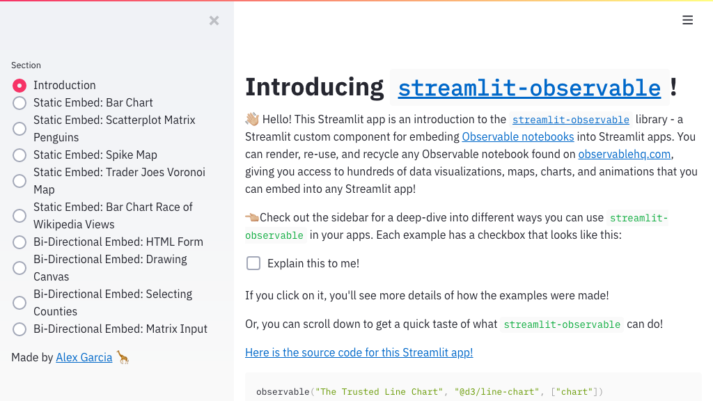</a><br><h3><a href="https://streamlit-observable.herokuapp.com/">Observable</a></h3><p>⭐ 28 · <a href="https://github.com/asg017/streamlit-observable">:octocat: Code</a></p><p>Embed Observable notebooks into Streamlit apps!</p><p><sup>by <a href="https://github.com/asg017">@asg017</a></sup></p></td></tr><tr align="center"><td valign="top" width="33.3%"><br><a href="https://github.com/turner-anderson/streamlit-cropper"></a><br><h3><a href="https://github.com/turner-anderson/streamlit-cropper">Cropper</a></h3><p>⭐ 28 · <a href="https://github.com/turner-anderson/streamlit-cropper">:octocat: Code</a></p><p>A simple image cropper for Streamlit</p><p><sup>by <a href="https://github.com/turner-anderson">@turner-anderson</a></sup></p></td></tr><tr align="center"><td valign="top" width="33.3%"><br><a href="https://github.com/asehmi/Data-Science-Meetup-Oxford/tree/master/StreamlitComponent"></a><br><h3><a href="https://github.com/asehmi/Data-Science-Meetup-Oxford/tree/master/StreamlitComponent">Auth0 with Next.js</a></h3><p>⭐ 28 · <a href="https://github.com/asehmi/Data-Science-Meetup-Oxford">:octocat: Code</a></p><p>Content shared at DS-OX Meetup</p><p><sup>by <a href="https://github.com/asehmi">@asehmi</a></sup></p></td></tr><tr align="center"><td valign="top" width="33.3%"><br><a href="https://github.com/jrieke/streamlit-analytics"></a><br><h3><a href="https://github.com/jrieke/streamlit-analytics">Analytics</a></h3><p>⭐ 21 · <a href="https://github.com/jrieke/streamlit-analytics">:octocat: Code</a></p><p>Track & visualize user interactions with your streamlit app</p><p><sup>by <a href="https://github.com/jrieke">@jrieke</a></sup></p></td></tr><tr align="center"><td valign="top" width="33.3%"><br><a href="https://share.streamlit.io/randyzwitch/streamlit-embedcode/examples/streamlit_app.py"></a><br><h3><a href="https://share.streamlit.io/randyzwitch/streamlit-embedcode/examples/streamlit_app.py">Embedcode</a></h3><p>⭐ 16 · <a href="https://github.com/randyzwitch/streamlit-embedcode">:octocat: Code</a></p><p>Streamlit component for embedding code snippets such as GitHub gists, CodePen snippets,...</p><p><sup>by <a href="https://github.com/randyzwitch">@randyzwitch</a></sup></p></td></tr><tr align="center"><td valign="top" width="33.3%"><br><a href="https://share.streamlit.io/andfanilo/streamlit-lottie-demo/master/app.py"></a><br><h3><a href="https://share.streamlit.io/andfanilo/streamlit-lottie-demo/master/app.py">Lottie</a></h3><p>⭐ 15 · <a href="https://github.com/andfanilo/streamlit-lottie">:octocat: Code</a></p><p>Streamlit component to render Lottie animations</p><p><sup>by <a href="https://github.com/andfanilo">@andfanilo</a></sup></p></td></tr><tr align="center"><td valign="top" width="33.3%"><br><a href="https://github.com/napoles-uach/streamlit_3dmol"></a><br><h3><a href="https://github.com/napoles-uach/streamlit_3dmol">3dmol</a></h3><p>⭐ 14 · <a href="https://github.com/napoles-uach/streamlit_3dmol">:octocat: Code</a></p><p>This project aims to provide an easy way to create a web app for interacting with molec...</p><p><sup>by <a href="https://github.com/napoles-uach">@napoles-uach</a></sup></p></td></tr><tr align="center"><td valign="top" width="33.3%"><br><a href="https://www.innerdoc.com/nlp-timeline-demo/"></a><br><h3><a href="https://www.innerdoc.com/nlp-timeline-demo/">Timeline</a></h3><p>🐣 New · ⭐ 8 · <a href="https://github.com/innerdoc/streamlit-timeline">:octocat: Code</a></p><p>A simple Streamlit Component to display a Timeline in Streamlit apps. It integrates Kni...</p><p><sup>by <a href="https://github.com/innerdoc">@innerdoc</a></sup></p></td></tr><tr align="center"><td valign="top" width="33.3%"><br><a href="https://share.streamlit.io/okld/streamlit-player-demo/main/app.py"></a><br><h3><a href="https://share.streamlit.io/okld/streamlit-player-demo/main/app.py">Player</a></h3><p>⭐ 6 · <a href="https://github.com/okld/streamlit-player">:octocat: Code</a></p><p>A streamlit component to embed video and music players from various websites</p><p><sup>by <a href="https://github.com/okld">@okld</a></sup></p></td></tr><tr align="center"><td valign="top" width="33.3%"><br><a href="https://share.streamlit.io/okld/streamlit-disqus-demo/main/app.py"></a><br><h3><a href="https://share.streamlit.io/okld/streamlit-disqus-demo/main/app.py">Disqus</a></h3><p>⭐ 2 · <a href="https://github.com/okld/streamlit-disqus">:octocat: Code</a></p><p>A streamlit component to embed Disqus in your applications</p><p><sup>by <a href="https://github.com/okld">@okld</a></sup></p></td></tr><tr align="center"><td valign="top" width="33.3%"><br><a href="https://share.streamlit.io/okld/streamlit-discourse-demo/main/app.py"></a><br><h3><a href="https://share.streamlit.io/okld/streamlit-discourse-demo/main/app.py">Discourse</a></h3><p>⭐ 1 · <a href="https://github.com/okld/streamlit-discourse">:octocat: Code</a></p><p>A streamlit component to embed Discourse topics in your applications</p><p><sup>by <a href="https://github.com/okld">@okld</a></sup></p></td></tr></table></details>

<br>

## 🎈 Official Demos

<a href="#"></a>

<table width="100%"><tr align="center"><td valign="top" width="33.3%"><br><a href="https://share.streamlit.io/streamlit/demo-self-driving"></a><br><h3><a href="https://share.streamlit.io/streamlit/demo-self-driving">Udacity Self-driving Car</a></h3><p>⭐ 800 · <a href="https://github.com/streamlit/demo-self-driving">:octocat: Code</a></p><p>Streamlit app demonstrating an image browser for the Udacity self-driving-car dataset w...</p><p><sup>by <a href="https://github.com/streamlit">@streamlit</a></sup></p></td></tr><tr align="center"><td valign="top" width="33.3%"><br><a href="https://share.streamlit.io/streamlit/demo-face-gan/"></a><br><h3><a href="https://share.streamlit.io/streamlit/demo-face-gan/">Face-GAN Explorer</a></h3><p>⭐ 190 · <a href="https://github.com/streamlit/demo-face-gan">:octocat: Code</a></p><p>A demonstration of using a live Tensorflow session to create an interactive face-GAN ex...</p><p><sup>by <a href="https://github.com/streamlit">@streamlit</a></sup></p></td></tr><tr align="center"><td valign="top" width="33.3%"><br><a href="https://share.streamlit.io/streamlit/demo-uber-nyc-pickups/"></a><br><h3><a href="https://share.streamlit.io/streamlit/demo-uber-nyc-pickups/">Uber Pickups in NYC</a></h3><p>⭐ 150 · <a href="https://github.com/streamlit/demo-uber-nyc-pickups">:octocat: Code</a></p><p>A Streamlit demo to interactively visualize Uber pickups in New York City</p><p><sup>by <a href="https://github.com/streamlit">@streamlit</a></sup></p></td></tr><tr align="center"><td valign="top" width="33.3%"><br><a href="https://github.com/streamlit/demo-deepdream"></a><br><h3><a href="https://github.com/streamlit/demo-deepdream">Deep Dream</a></h3><p>⭐ 3 · <a href="https://github.com/streamlit/demo-deepdream">:octocat: Code</a></p><p>A Streamlit demo demonstrating the Deep Dream technique. Adapted from the TensorFlow De...</p><p><sup>by <a href="https://github.com/streamlit">@streamlit</a></sup></p></td></tr></table>

<br>

## 📬 Contributing

Built or discovered a new streamlit app? I'd love to have it in this list! You can 
either:

- [Open an issue](https://github.com/jrieke/best-of-streamlit/issues/new/choose) with 
a link to the app/repo
- Add the app yourself by [editing projects.yaml directly online](https://github.com/jrieke/best-of-streamlit/edit/main/projects.yaml) 
(no forking required). Just add the following information at the end of this file:

    ```yaml
    - name: App Name  # required; keep it short
      homepage: link/to/deployment  # required; if not deployed, give repo link
      image: link/to/gif/png/jpg  # optional; if not given, will take screenshot of homepage
      github_id: owner/repo  # optional
      category: one of the categories below  # required
      show: True
    ```

    For `category`, choose one from below (e.g. `ml`) or leave empty if you are not 
    sure:
 
    ```yaml
    - category: ml
      title: 🤖 General Machine Learning
    - category: nlp
      title: 📚 Natural Language Processing
    - category: cv
      title: 👁️ Computer Vision
    - category: audio
      title: 🎵 Audio
    - category: sci-tech
      title: 🔬 Science & Technology
    - category: business
      title: 💰 Business & Economy
    - category: non-ml
      title: 🚀 Non-ML Apps
    - category: extension
      title: 🧰 Extensions & Components
    - category: demo
      title: 🎈 Official Demos
    ```

    *Note: The new app will not show up in the gallery directly. I first need to 
    re-generate the README.md file from projects.yaml after your changes are merged.*

- If you want to suggest any other change, feel free to [open an issue](https://github.com/jrieke/best-of-streamlit/issues/new/choose) 
as well :)

<br>

## Related Resources

- [**awesome-streamlit**](https://github.com/MarcSkovMadsen/awesome-streamlit): Website with several built-in streamlit apps and other resources
- [**Streamlit App Gallery**](https://www.streamlit.io/gallery): Official gallery with tweets about new streamlit apps
- [**Streamlit Components**](https://www.streamlit.io/components): Official collection of featured streamlit components
- [**Best-of lists**](https://best-of.org): Discover other best-of lists with awesome open-source projects on all kinds of topics

<!-- ## Contribution

Contributions are encouraged and always welcome! If you like to add or update projects, choose one of the following ways:

- Open an issue by selecting one of the provided categories from the [issue page](https://github.com/jrieke/best-of-streamlit/issues/new/choose) and fill in the requested information.
- Modify the [projects.yaml](https://github.com/jrieke/best-of-streamlit/blob/main/projects.yaml) with your additions or changes, and submit a pull request. This can also be done directly via the [Github UI](https://github.com/jrieke/best-of-streamlit/edit/main/projects.yaml).

If you like to contribute to or share suggestions regarding the project metadata collection or markdown generation, please refer to the [best-of-generator](https://github.com/best-of-lists/best-of-generator) repository. If you like to create your own best-of list, we recommend to follow [this guide](https://github.com/best-of-lists/best-of/blob/main/create-best-of-list.md).

For more information on how to add or update projects, please read the [contribution guidelines](https://github.com/jrieke/best-of-streamlit/blob/main/CONTRIBUTING.md). By participating in this project, you agree to abide by its [Code of Conduct](https://github.com/jrieke/best-of-streamlit/blob/main/.github/CODE_OF_CONDUCT.md). -->

<br>

## License

[](https://creativecommons.org/licenses/by-sa/4.0/)
